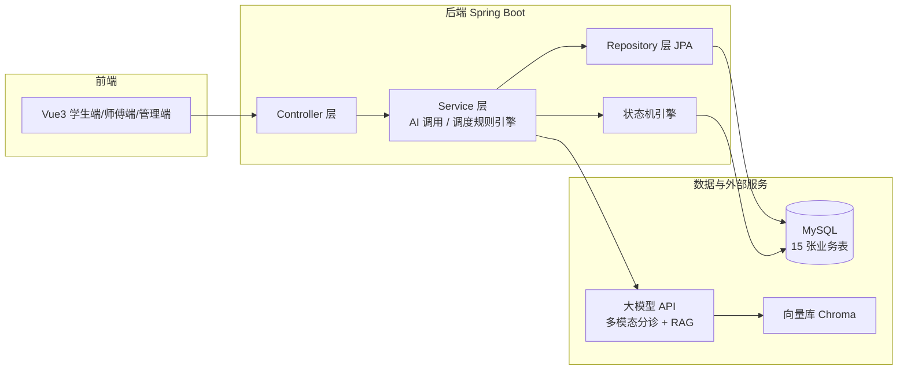

# 系统详细设计

## 1. 架构图



## 2. 后端分层设计

- `controller`：接收请求、参数校验、返回统一格式
- `service`：业务逻辑（含 AI 调用、调度规则引擎）
- `repository`：数据访问（Spring Data JPA）
- `entity`：数据库实体
- `dto`：数据传输对象（含统一返回 ApiResponse）
- `config`：配置类（如跨域 CorsConfig）

## 3. 核心模块设计

### 3.1 状态机设计（工单）

```
SUBMITTED → ASSIGNED → ON_THE_WAY → PROCESSING → PENDING_ACCEPT → COMPLETED
     └→ CANCELLED            └→ RESCHEDULED
                                  ├→ ASSIGNED（重新派单成功）
                                  ├→ SUBMITTED（重新派单失败）
                                  └→ CANCELLED
```

- 状态流转通过 `order_status_log` 记录，保证幂等（非法流转被拒绝）
- 完整流转表与枚举值见 `docs/需求分析.md` 5.2、`docs/数据项设计.md` §3

### 3.2 调度规则

- 匹配维度：故障类别、位置（楼栋）、师傅排班时间窗、当前负载
- 冲突检测：同一时间窗已满则尝试相邻时间窗

### 3.3 RAG 自助诊断

- 知识来源：维修手册 + 历史工单回流
- 流程：问题 → 向量化 → 检索 → Rerank → 大模型回答

## 4. 数据库设计

见 [sql/init.sql](./sql/init.sql)，共 15 张表（与 `docs/需求分析.md` 5.1、`docs/数据项设计.md` 保持一致）：

- user：三类角色统一管理，师傅档案（专长）也存本表
- repair_category：故障类别（含可自助解决标记）
- repair_order：工单（核心），含派单字段 assign_score/assign_reason、幂等键 idempotency_key、乐观锁 version
- worker_schedule：师傅排班
- knowledge_base：维修知识库（RAG 来源）
- order_status_log：状态流转日志
- order_evaluation：服务评价
- notification：通知消息
- diagnosis_session：自助诊断会话（自修解决率统计）